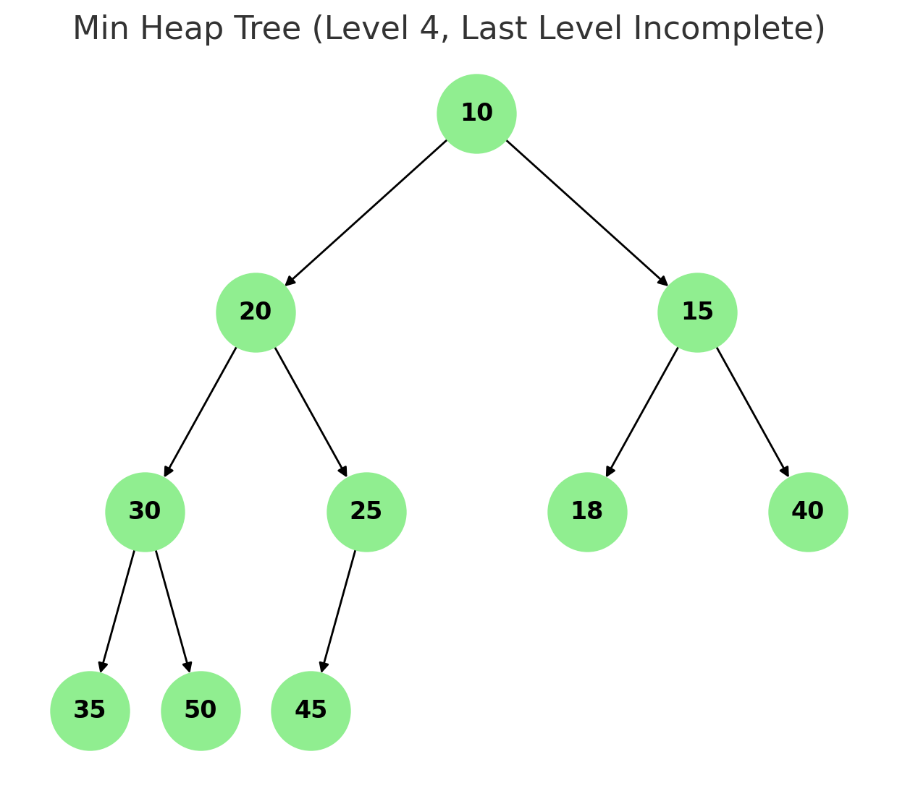

# 힙(Heap)

## 0. 우선순위 큐(Priority Queue)

- 우선순위의 개념을 큐에 도입한 자료구조
→ 데이터들이 우선순위를 가지고 있어서 들어간 순서와 상관 없이 우선순위가 높은 원소가 먼저 나옴
- 가장 중요한 원소를 빨리 찾아야 하는 경우 유용
- 우선순위 큐는 배열, 연결리스트, 힙으로 구현할 수 있는데 이때 힙 구현이 가장 효율
- Java에서는 java.util.PriorityQueue를 활

### 우선순위 큐의 활용 예시

1. 운영체제 스케줄링 (우선순위가 높은 프로세스 먼저 실행)
2. 다익스트라(Dijkstra), A* 같은 최단 경로 알고리즘
3. Top-K 문제 (가장 큰 값 K개, 가장 작은 값 K개 뽑기)
4. 네트워크 패킷 처리 (긴금 데이터 우선 전송)

---

## 1. 힙(Heap)이란

- **완전 이진 트리를 기반**으로 하는 특수한 트리 기반의 자료구조
(* 완전 이진 트리 : 이진트리에서 왼쪽에서부터 빈칸 없이 차례대로 노드가 채워진 트리)
- 부모-자식 간 특정한 순서(규칙)을 따르는 자료구조
→ 부모가 자식보다 항상 우선순위가 높다는 성질을 가진 트리
- `우선순위 큐`를 구현하는데 주로 사용된다.
- 삽입, 삭제, 탐색 연산을 효율적으로 수행 가능

---

## 2. 최대 힙(Max Heap)과 최소 힙(Min Heap)

### 2-1. 최대 힙(Max Heap)


- 키 값이 가장 큰 노드를 찾기 위한 완전 이진 트리
- 부모 노드의 키 값 ≥ 자식 노드의 키 값
- 루트 노드 : 키 값이 가장 큰 노드

### 2-2. 최소 힙(Min Heap)



- 키 값이 가장 작은 노드를 찾기 위한 완전 이진 트리
- 부모 노드의 키 값 ≤ 자식 노드의 키 값
- 루트 노드 : 키 값이 가장 작은 노드

---

## 3. 힙의 연산

### 3-1. 삽입 연산

1. 트리의 마지막 레벨의 가장 왼쪽 빈자리에 새로운 원소를 삽입
(완전 이진트리 형태 유지)
2. 부모 노드의 값과 비교하여 *힙 조건을 위반한 경우 부모와 교환
(* 최대 힙 : 부모 ≥ 자식 // * 최소 힙 : 부모 ≤ 자식)
3. 이 과정을 루트까지 힙 속성이 만족될 때까지 반복

### ex) 최대 힙에 `95` 삽입

```markdown
초기 힙 (최대 힙):
        100
       /   \
     90     85
    / \    /
  70  60  80

[1] 95를 마지막에 삽입:
        100
       /   \
     90     85
    / \    / \
  70  60  80  95

[2] 부모(85)보다 크므로 교환:
        100
       /   \
     90     95
    / \    / \
  70  60  80  85

```

```java
// 힙 삽입 구현
public static void insertion(int newValue) {
		// 트리의 끝에 새로운 값을 추가한다.
		heap[++heapSize] = newValue;
		
		// 부모 노드와 크기 비교
		// 부모 노드의 값보다 클 경우 교환 필요 (최대 힙)
		int ch = heapSize; // 자식의 인덱스
		int p = ch/2; // 버림 처리 필요 하지만 int형이라 버려짐
		
		while(p > 0 && heap[p] < heap[ch]) {
			// 부모 노드의 값이 자식보다 작을 경우 계속 반복
			// swap
			int temp = heap[p];
			heap[p] = heap[ch];
			heap[ch] = temp;
			
			// 포인터 갱신
			ch = p;
			p = ch/2;
			// 부모 인덱스가 0이 될 경우 루트 노드에 도달한 것이므로 반복 종료
		}
	}
```

### 3-2. 삭제 연산

힙의 루트 노드(최댓값 / 최솟값)을 꺼내는 과정

1. 루트 노드를 제거
2. 마지막 노드를 루트로 이동 (이때도 완전 이진트리 형태 유지)
3. 자식과 비교하여 힙 조건 위반 시 자식과 교환
4. 조건이 만족될 때까지 내려감

### 예: 최대 힙에서 루트(100) 삭제

```
초기 힙:
        100
       /   \
     90     85
    / \    / \
  70  60  80  95

[1] 루트 100 삭제, 마지막 노드 95를 루트로 이동:
        95
       /   \
     90     85
    / \    /
  70  60  80

[2] 자식(90, 85) 중 더 큰 90과 비교 → 95 ≥ 90, 조건 만족 → 종료

```

```java
// 힙 삭제 구현
public static Integer deletion() {
		// 힙이 공백일 경우 null 값 반환
		if(heapSize == 0) {
			return null;
		}

		int maxValue = heap[1]; // 반환 할 값 저장 (최대힙이므로 최댓값)
		
		// 마지막 원소를 루트 자리에 놓는다.
		heap[1] = heap[heapSize];
		heapSize--;
		
		int p = 1; // 부모 노드 인덱스
		int ch = p*2; // 왼쪽 자식 노드 인덱스
		if(ch+1 <= heapSize && heap[ch] < heap[ch+1]) {
			// 첫번째 조건 : 오른쪽 자식 노드가 힙 범위 안에 존재하는지 확인
			// 두번째 조건 : 왼쪽 자식보다 오른쪽 자식 값이 더 큰 경우 확인
			ch += 1; // 비교 대상 자식을 오른쪽 자식으로 다시 세팅
		}
		
		// 값을 비교하며 내려가기
		while(ch<=heapSize && heap[p]<heap[ch]) {
		  // 부모노드가 자식노드보다 작은 경우 값 교환 (최대힙 기준)
			// swap
			int tmp = heap[p];
			heap[p] = heap[ch];
			heap[ch] = tmp;
			
			// 갱신
			p = ch; // 왼쪽 자식일 수도 있고, 오른쪽 자식일 수도 있음
			ch = p*2;
			if(ch+1 <= heapSize && heap[ch] < heap[ch+1]) {
				ch += 1; // 오른쪽 자식으로 다시 세팅
			}
		}
		return item;
	}
```

---

## 4. Heap의 시간 복잡도

- 삽입(insert) : O(log n) (최대 트리 높이만큼 비교)
- 삭제(delete) : O(log n) (최대 트리 높이만큼 비교)
- 조회(peek) : O(1) (루트 반환)

### 4-0. 힙이 log n의 시간복잡도를 갖는 이유

힙은 완전 이진트리 구조를 가지므로 노드 수가 n인 완전 이진트리에서 깊이는 log₂ n에 비례한다.
→ 즉, 노드가 n일 때 트리 높이(height) =(약) `log₂ n`가 된다.

ex) 

- 노드가 8개면 트리 높이는 약 3 (`log₂ 8 = 3`)
- 노드가 16개면 트리 높이는 약 4 (`log₂ 16 = 4`)
- 즉, 원소 수가 2배가 되면 높이가 1만 증가하기 때문

---

## 5. 힙/우선순위 큐 관련 예상 질문

- 최대 힙(Max Heap)과 최소 힙(Min Heap)의 차이
- 힙과 일반 이진 탐색 트리의 차이
- 완전 이진트리가 무엇이고, 힙은 왜 완전 이진트리여야 하는가?
- 힙을 배열로 구현했을 때 장점은 무엇이고, 연결 리스트로 구현한다면 어떤 문제가 있는가?

---

참고자료

Computer Science/Data Structure/Heap.md
