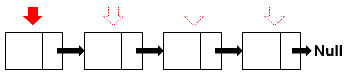
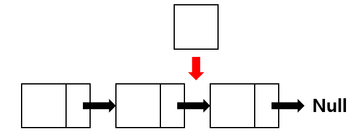
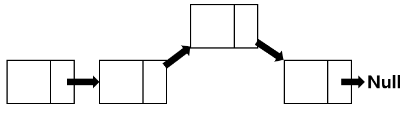
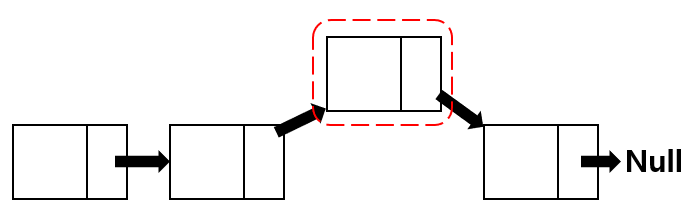
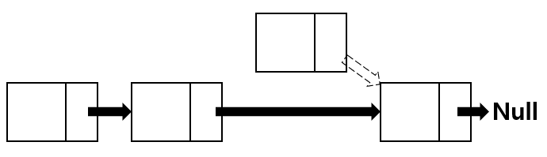
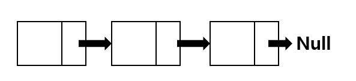

# Linked List

## 1. Linked List 개요
- **연결 리스트(Linked List)** 는 데이터를 **노드(Node)** 단위로 저장하고, 각 노드가 **다음 노드의 주소(포인터)** 를 가리키는 구조.
- 배열(Array)과 달리 **연속된 메모리 공간이 필요하지 않음** → 삽입/삭제가 용이.

---

### 1-1. 검색

---
    Head노드에서부터 Tail노드까지 순차적으로 순회하면서 데이터를 찾음

### 1-2. 추가
    추가할 때에는 원하는 노드를 하나 만들고 그 노드와 Tail노드의 next pointer를 연결함
    ArrayList 와 달리, 끝 노드를 찾지 않아도 되고 그저 Tail노드에서 새로운 노드를 추가하면 됨

### 1-3. 삽입
    중간에 삽입할 때에는 데이터를 뒤로 한 칸씩 밀어줄 필요가 없고 간단히 pointer만 바꿔주면 됨
    하지만 삽입 위치를 찾기 위해서는 순회를 통해 찾아야만 함
---


---

### 1-4. 삭제
    LinkedList에서 삭제도 마찬가지로 **pointer만 조금 바꾸어주면** 삭제 과정이 자동으로 이루어짐

---
    빨간 점선으로 된 노드를 삭제해보자.


---
    이전 노드의 next pointer는 삭제할 노드의 next pointer가 가리키고 있던 노드를 가리키고
    삭제 노드의 next pointer는 아무것도 가리키지 않는 상태인 null 로 되게 함, 즉 node.next = null;


---
    그 이후 자바에서 garbage collector에 의해 붕떠 있던 삭제 노드는 알아서 사라지고 노드가 삭제된 LinkedList의 모습

## 2. 구조
- **노드(Node)**: 데이터(data) + 포인터(next)
- 종류:
  - **단일 연결 리스트(Singly Linked List)**: 한 방향(next)만 가리킴
  - **이중 연결 리스트(Doubly Linked List)**: 앞(prev)과 뒤(next)를 모두 가리킴
  - **원형 연결 리스트(Circular Linked List)**: 마지막 노드가 처음 노드를 가리킴

---

## 3. 시간 복잡도
| 연산             | 배열(Array) | 연결 리스트(Linked List) |
|------------------|-------------|--------------------------|
| 접근(Access)     | O(1)        | O(n)                     |
| 탐색(Search)     | O(n)        | O(n)                     |
| 삽입(Insert)     | O(n)        | O(1) (노드 위치 알고 있다면) |
| 삭제(Delete)     | O(n)        | O(1) (노드 위치 알고 있다면) |

---

## 4. 특징
### ✅ 장점
- 삽입/삭제가 빠르다 (특히 맨 앞, 중간에서)  
- 메모리를 연속적으로 사용하지 않아도 된다  

### ❌ 단점
- 임의 접근(random access)이 불가능 → 특정 위치 접근 시 O(n)  
- 포인터 저장 공간이 필요해서 메모리 효율이 떨어짐  

---

## 5. 큐(Queue)와 연결 리스트의 관계
- **큐(Queue)**: 추상 자료형(ADT) → FIFO(First In, First Out) 규칙만 정의
  - `enqueue`: 뒤(rear)에 삽입
  - `dequeue`: 앞(front)에서 삭제
- **연결 리스트(Linked List)**: 큐를 구현하는 한 가지 방법
- 즉, **큐는 '규칙', 연결 리스트는 '구현체'**

---

## 6. 배열 기반 큐 vs 연결 리스트 기반 큐

| 비교 항목       | 배열 기반 큐 (Array Queue)          | 연결 리스트 기반 큐 (Linked Queue)   |
|----------------|------------------------------------|-------------------------------------|
| 크기 제한       | 고정 (미리 크기 지정 필요)          | 동적 (필요할 때마다 노드 추가 가능) |
| 메모리 효율     | 연속된 메모리 필요                  | 포인터 공간 추가 필요               |
| 접근 속도       | 임의 접근 O(1) 가능                 | 임의 접근 불가능 O(n)               |
| 삽입/삭제       | `dequeue` 시 O(n) (앞 원소 당김 필요) | `enqueue`/`dequeue` 모두 O(1)       |
| 구현 난이도     | 간단                                | 포인터 관리 필요 → 조금 더 복잡     |

---

## 7. 간단한 예시 코드 (Java)

### 배열 기반 큐
```java
class ArrayQueue {
    int[] arr;
    int front, rear, size, capacity;

    ArrayQueue(int capacity) {
        this.capacity = capacity;
        arr = new int[capacity];
        front = size = 0;
        rear = capacity - 1;
    }

    boolean isFull() { return size == capacity; }
    boolean isEmpty() { return size == 0; }

    void enqueue(int item) {
        if (isFull()) throw new RuntimeException("Queue is full");
        rear = (rear + 1) % capacity;
        arr[rear] = item;
        size++;
    }

    int dequeue() {
        if (isEmpty()) throw new RuntimeException("Queue is empty");
        int item = arr[front];
        front = (front + 1) % capacity;
        size--;
        return item;
    }
}
```

### 연결 리스트 기반 큐
```
class Node {
    int data;
    Node next;
    Node(int data) { this.data = data; }
}

class LinkedQueue {
    Node front, rear;

    void enqueue(int data) { // 맨 뒤에 추가
        Node newNode = new Node(data);
        if (rear != null) rear.next = newNode;
        rear = newNode;
        if (front == null) front = rear;
    }

    int dequeue() { // 맨 앞에 원소 삭제
        if (front == null) throw new RuntimeException("Queue is empty");
        int val = front.data;   // 맨 앞 값 저장
        front = front.next;     // front를 한칸 앞으로 이동
        if (front == null) rear = null;
        return val;
    }

    boolean isEmpty() { return front == null; }
}
```

## 8. 면접에서 자주 묻는 질문
    1. 배열과 연결 리스트의 차이는? 배열은 빠른 접근 가능, 삽입/삭제는 느림. 연결리스트는 반대.
    2. 단일 연결 리스트와 이중 연결 리스트 차이는? 단일은 한쪽 방향만, 이중은 양방향 탐색 가능.
    3. 원형 연결 리스트는 언제 유용한가? 라운드 로빈 (Round Robin) 같은 순환 구조에서 사용.
    4. 큐를 배열과 연결 리스트로 각각 구현했을 때 차이점은? 배열은 크기 고정, `deque`시 O(n) 발생. 연결 리스트는 크기 동적, 삽입/삭제 O(1).
    5. 스택/큐를 연결 리스트로 구현할 수 있는가? 가능하다. 특히 큐에서 head/tail 포인터 활용.


