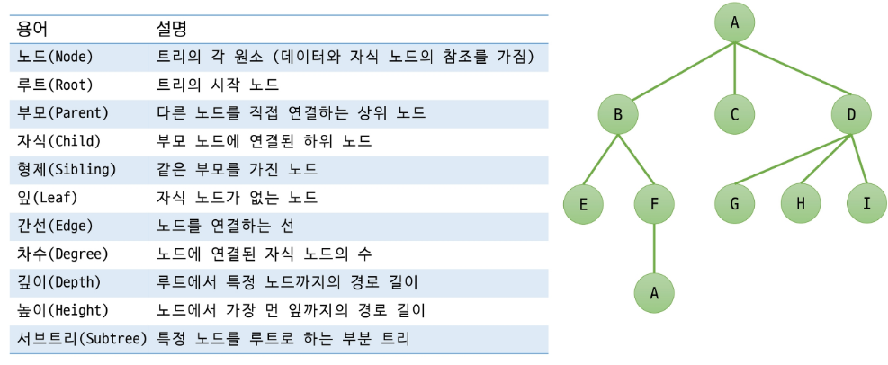
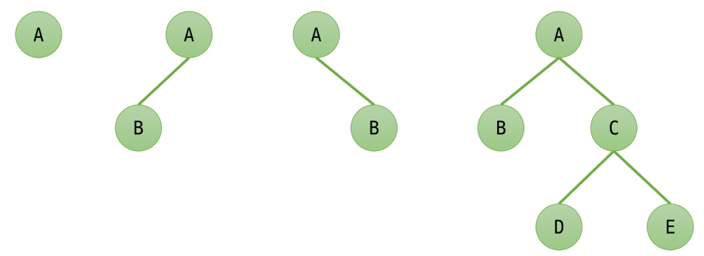
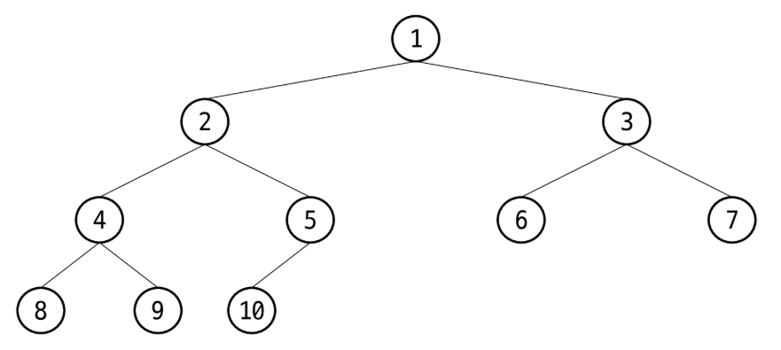
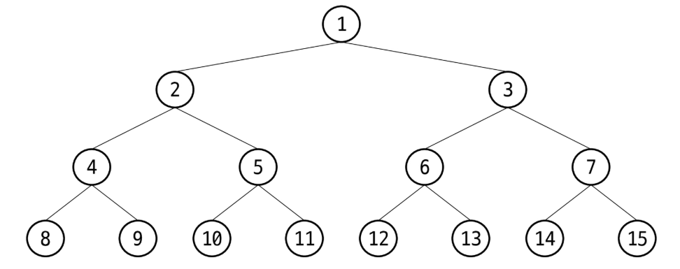

# 🌳 트리(Tree)

## 📌 정의
- 계층적 구조를 표현하는 **비선형 자료구조**  
- **1 : N** 의 관계를 가지는 자료구조  
- 한 개 이상의 노드로 이루어진 유한 집합  
- 상위 원소에서 하위 원소로 내려가면서 확장되는 나무 모양의 구조  

---

## 🌱 트리 구성요소
- **루트(Root)**: 트리의 시작 노드  
- **노드(Node)**: 데이터를 저장하는 기본 단위  
- **간선(Edge)**: 노드와 노드를 연결하는 선  
- **부모(Parent)**: 특정 노드를 직접 연결하고 있는 상위 노드  
- **자식(Child)**: 부모로부터 뻗어나온 하위 노드  
- **리프(Leaf)**: 자식이 없는 마지막 노드  
- **레벨(Level)**: 루트로부터 해당 노드까지의 깊이(depth)
    

---

## 🌿 트리의 종류
- **이진 트리(Binary Tree)**
  각 노드가 최대 2개의 자식을 가지는 트리  
    
- **완전 이진 트리(Complete Binary Tree)**
  마지막 레벨을 제외하고 노드가 꽉 차 있는 이진 트리  
    
- **포화 이진 트리(Full Binary Tree)**
  모든 레벨이 꽉 차 있고, 모든 내부 노드가 두 개의 자식을 가지는 트리  
    
- **이진 탐색 트리(Binary Search Tree, BST)**  
  왼쪽 자식 < 부모 < 오른쪽 자식의 규칙을 가지는 트리  
- **힙(Heap)**  
  완전 이진 트리 기반으로, 부모가 자식보다 크거나(최대 힙) 작은(최소 힙) 트리  
- **균형 트리(AVL, Red-Black Tree 등)**  
  트리의 높이를 일정하게 유지하여 탐색 속도를 보장하는 트리  

---

## 🍀 트리의 특징
- 트리에는 **사이클이 존재하지 않는다**. (사이클이 생기면 그래프!)  
- 루트에서 한 노드로 가는 경로는 **유일하다**.  
- 노드의 개수가 N개이면, 간선의 개수는 **N-1**개이다.  
- 각 노드는 자료형으로 표현이 가능하다.  

---

## 🔄 순회 (Traversal)
- 트리의 노드들을 **중복되지 않게 전부 방문**하는 것을 말함
- 트리는 비선형 구조 이므로 선형 구조와 같이 선후 연결 관계를 알 수 없음

---

## 🔄 순회 방식 (Tree Traversal)
트리를 탐색하는 대표적인 방법들 ✨  

1. **전위 순회 (Preorder Traversal)**: Root → Left → Right  
2. **중위 순회 (Inorder Traversal)**: Left → Root → Right  
3. **후위 순회 (Postorder Traversal)**: Left → Right → Root  
4. **레벨 순회 (Level Order Traversal)**: 위에서부터 레벨 단위로 순서대로  

---

## 💻 코드 예시

```java
class Node {
    int data;
    Node left, right;

    Node(int data) {
        this.data = data;
        this.left = this.right = null;
    }
}

public class TreeTraversal {
    Node root;

    // 전위순회
    void preorder(Node node) {
        if (node == null) return;
        System.out.print(node.data + " ");
        preorder(node.left);
        preorder(node.right);
    }

    // 중위순회
    void inorder(Node node) {
        if (node == null) return;
        inorder(node.left);
        System.out.print(node.data + " ");
        inorder(node.right);
    }

    // 후위순회
    void postorder(Node node) {
        if (node == null) return;
        postorder(node.left);
        postorder(node.right);
        System.out.print(node.data + " ");
    }
}
```

---

## 🏢 현업에서의 활용
- 데이터베이스 인덱스 구조 (B-Tree, B+Tree)
- 파일 시스템 구조 (디렉토리 트리)
- 게임 트리 (AI, 미니맥스 알고리즘)
- HTML DOM 트리
- 컴파일러의 구문 트리(AST, Abstract Syntax Tree)

---

## ❓ 면접 & 스터디 예상 질문
**1. 트리와 그래프의 차이점은 무엇인가요?**
- 트리는 사이클이 없는 연결 그래프이며, 부모-자식 관계가 존재하는 계층적 구조.
- 그래프는 방향성, 가중치, 사이클 여부에 따라 다양한 구조를 가질 수 있음.

**2. 이진 탐색 트리의 장단점을 설명해보세요.**
- 장점: 탐색, 삽입, 삭제 연산이 평균적으로 O(log N) 으로 효율적.
- 단점: 한쪽으로 치우친 경우(편향 트리)는 O(N) 까지 성능이 나빠질 수 있음.

**3. 이진 트리의 순회 방법에는 어떤 것들이 있나요?**
- 전위 순회 (Preorder: Root → Left → Right)
- 중위 순회 (Inorder: Left → Root → Right)
- 후위 순회 (Postorder: Left → Right → Root)
- 레벨 순회 (Level-order: BFS 방식, 위에서 아래로)

**4. 노드의 개수가 N개일 때, 간선은 몇 개인가요?**
- 트리의 경우: N - 1개
- 그래프의 경우는 구조에 따라 달라짐.

**5. 균형 트리가 필요한 이유는 무엇인가요?**
- 탐색, 삽입, 삭제 등의 연산을 항상 O(log N) 에 가깝게 보장하기 위해 필요.
- 불균형한 트리는 선형 구조(Linked List)처럼 되어 효율이 크게 떨어짐.
