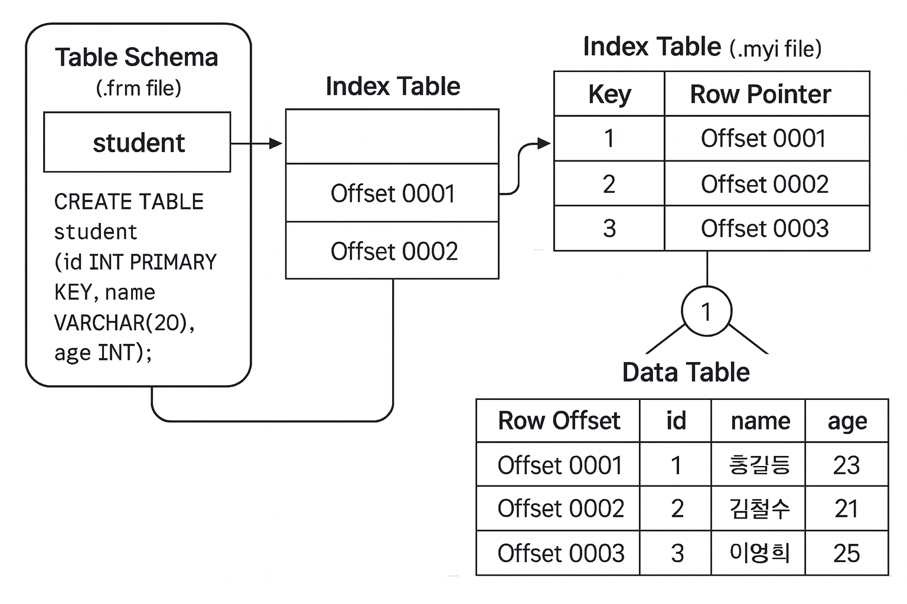

# Index (인덱스)

---

## 1. 개요



```jsx
추가적인 쓰기 작업과 저장 공간을 활용하여 데이터베이스 테이블의 검색 속도를 향상시키기 위한 구조
```

- 인덱스(Index)는 데이터베이스에서 **검색 속도**를 높이기 위해 사용하는 자료 구조
- 책의 목차처럼 원하는 데이터를 빠르게 찾을 수 있도록 도와주는 역할
    
    데이터가 저장된 위치를 빠르게 찾기 위한 보조 정보이며
    특히 대용량 테이블에서 **WHERE, JOIN, ORDER BY** 등의 **쿼리 성능을 향상**시킴
    ( ※ DELETE,INSERT,UPDATE쿼리에는 해당 사항없으며 INDEX사용시 좀 느려짐)
    

---

## 2. 인덱스의 원리

### ✖️ 인덱스가 없을 때 (Full Table Scan)

- 데이터를 찾을 때 모든 행을 처음부터 끝까지 비교해야 함
    
    ex) 100만 개의 레코드 중 id=50000을 찾으려면
          id가 일치할 때까지 1번부터 100만 번까지 전부 읽음
    
    ⇒ 시간 복잡도 O(N), 데이터가 많아질 수록 검색 속도가 선형적으로 느려짐
    

### ⭕ 인덱스가 있을 때 (Index Scan)

- 인덱스는 정렬된 자료구조(B+Tree 등) 형태로 유지 됨
그렇기 때문에 이진 탐색처럼 훨씬 빠르게 원하는 위치를 찾을 수 있음
    
    **⇒ 모든 데이터를 비교해보는 것이 아니라 인덱스(B+Tree)의 루트 노드에서 탐색 시작**
    
    ex) B+Tree의 시간 복잡도 : O(long N)
          각 루트 노드에서 범위를 비교하면서 하위 노드로 내려가기 때문에 
          트리의 높이(h)만큼 내려가면 값을 찾을 수 있게 됨. ⇒ 데이터의 양이 커질 수록 이점이 커짐
    

### 🌳 트리에서 데이터 탐색 하는 과정

- 인덱스는 일반적으로 B-Tree (또는 B+Tree) 구조를 사용
    - **B-Tree** : 모든 노드(내부 + 리프)에 데이터를 저장하는 균형 트리 구조
    - **B+Tree** : 데이터는 리프 노드에만 저장하고 리프 노드들이 연결 리스트로 이어져 있어 범위 스캔이 빠름
- **예를 들어 id = 42를 찾아야 할 때**
    
    B+Tree는 각 노드가 여러 키를 가지고 있음
    
    1. 루트 노드에서 범위를 비교 후 하위 브랜치 선택
    2. 브랜치 노드에서 다시 범위 비교 → 다음 노드로 이동
    3. 리프 노드에서 정확한 키 탐색 → 데이터 포인터로 이동

---

## 3. 파일 구성

- DBMS는 인덱스를 별도의 파일이나 페이지 단위로 저장
    - FRM : 테이블 구조 저장 파일
    - MYD : 데이터 파일 , 실제 테이블 데이터가 저장
    - MYI : 인덱스 파일, 인덱스 정보 (키 + 데이터 주소)가 저장됨
    
    ⇒ 사용자가 쿼리를 통해 Index를 사용하는 칼럼을 검색하게 되면 MYI 파일의 내용을 활용
    

---

## 4. 사용 목적

- 검색 속도 향상
- 정렬 비용 감소 (ORDER BY, GROUP BY)
- 중복 방지 (UNIQUE 인덱스)
- 조인 성능 향상
- 데이터 무결성 보장 (PK 인덱스)

---

## 5. 장/단점

### ✅ 장점

- 검색 속도 향상
- 대용량 데이터에서 빠른 조회
- 정렬 / 필터링 성능 개선

### ❎ 단점

- 쓰기 성능 저하 (INSERT/UPDATE/DELETE 시 인덱스도 갱신)
- 디스크 공간 추가 사용
- 잘못된 인덱스 사용 시 오히려 성능 저하

---

## 6. 인덱스 관리 방식

대부분의 RDBMS는 인덱스를 자동으로 유지 관리 하지만
사용하지 않는 **인덱스 제거** / **인덱스 통계 갱신(Analyze)** / **인덱스 재구성 (REBUILD)** 등은
**명시적 관리 필요**

| 구분 | 생성 방식 | 예시 | 설명 |
| --- | --- | --- | --- |
| ✅ **자동 생성 인덱스** | DB가 자동으로 만듦 | `PRIMARY KEY`, `UNIQUE` 제약조건 | 기본키나 유니크 제약을 설정하면 자동으로 인덱스가 생성됨 |
| ⚙️ **수동(직접) 생성 인덱스** | 개발자가 명시적으로 생성 | `CREATE INDEX` 명령 | 검색 성능을 높이고 싶은 컬럼에 직접 인덱스를 만들어야 함 |

### 자동 생성 인덱스

```sql
CREATE TABLE employee (
    emp_id INT PRIMARY KEY,   -- 자동으로 UNIQUE 인덱스 생성
    email  VARCHAR(100) UNIQUE -- 자동으로 UNIQUE 인덱스 생성
);
```

### 직접 생성 인덱스 명령어 예시

```sql
-- 단일 인덱스 생성
CREATE INDEX idx_employee_name
ON employee(name);

-- 결합 인덱스 생성
CREATE INDEX idx_employee_dept_name
ON employee(dept_id, name);

-- 함수 기반 인덱스 (Oracle 등에서 지원)
CREATE INDEX idx_upper_name
ON employee(UPPER(name));

```

### 인덱스 삭제 명령어

```sql
DROP INDEX idx_employee_name;
```

---

## 7. 인덱스의 종류

| 구분 | 정의 | 중복 허용 | 인덱스 기준 | 사용 목적 | 예시 |
| --- | --- | --- | --- | --- | --- |
| 🟩 **고유 인덱스**(Unique Index) | 중복값이 없는 인덱스 |  ❌ 불가능 | 단일 컬럼 | 데이터 무결성 보장 | Primary Key, 주민번호 |
| 🟦 **비고유 인덱스**(Non-Unique Index) | 중복값을 허용하는 인덱스 |  ✅ 가능 | 단일 컬럼 | 검색 성능 향상 | 부서 번호, 지역명 |
| 🟨 **단일 인덱스**(Single Index) | 하나의 컬럼에 인덱스 생성 |  ✅ 가능 | 단일 컬럼 | 단일 조건 검색 최적화 | name, age 등 |
| 🟧 **결합 인덱스**(Composite Index) | 두 개 이상 컬럼을 묶어서 인덱스 생성 |  ✅ 가능 | 다중 컬럼 | 다중 조건 검색 최적화 | (dept_id, name) |
| 🟪 **함수 기반 인덱스**(Function-Based Index) | 컬럼의 함수·계산식 결과값에 인덱스 생성 |  ✅ 가능 | 계산식 결과 | 함수/표현식 조건에서도 인덱스 활용 | UPPER(name), ABS(price) |

---

## 8. 인덱스 사용 상황

### ✅ 인덱스를 사용하면 좋은 경우

1. Where 절에서 자주 사용되는 컬럼
2. 외래키가 사용되는 컬럼
3. Join에 자주 사용되는 컬럼

### ❎ 인덱스 사용을 피해야 하는 경우

1. 데이터의 중복도가 높은 열은 인덱스로 만들어도 의미가 없음 ex) 성별
2. 사용하지 않는 인덱스는 제거
3. DML(INSERT/UPDATE/DELETE)이 자주 일어나는 컬럼의 경우 성능 저하
⇒ 데이터가 바뀌는 과정에서 인덱스 Key를 옮기는 작업이 발생하면서 논리적, 
     물리적 순서가 달라지거나 데이터 수와 인덱스 수가 달라지는 등의 문제가 발생할 수 있다.

---
### 참고
<a href="https://lalwr.blogspot.com/2016/02/db-index.html" target="_blank">lalwr.blogspot.com/2016/02/db-index.html</a> <br>
<a href="https://github.com/gyoogle/tech-interview-for-developer/blob/master/Computer%20Science/Database/%5BDB%5D%20Index.md" target="_blank">gyoogle/tech-interview-for-developer/blob/master/Computer%20Science/Database/%5BDB%5D%20Index.md</a>
