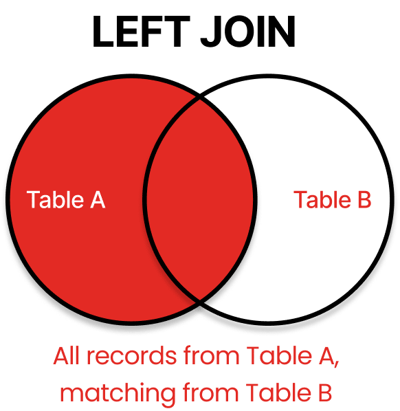

# JOIN

## 1. JOIN 이란

- **조인(JOIN)** 이란, 두 개 이상의 테이블이나 데이터베이스를 **공통된 칼럼(조인 키)** 을 이용하여 연결하고 데이터를 검색하는 방법.
- 관계형 데이터베이스 (Relational Database, RBD)에서 **데이터 통합 및 분석**의 핵심 기능.
- 테이블을 연결하려면, 적어도 하나의 칼럼을 서로 공유하고 있어야함.

<br>

### 1-1. JOIN 이해를 위한 예시 데이터 설정

- JOIN의 작동 방식을 시각적으로 보여주기 위해 간단한 두 테이블

### 직원 (Employee) 테이블 (A)

| EmpID | Name   | DeptID | ManagerID |
| ----- | ------ | ------ | --------- |
| 101   | 김철수 | 10     | 100       |
| 102   | 이영희 | 20     | 101       |
| 103   | 박민수 | 10     | 100       |
| 104   | 최유리 | 30     | NULL      |
| 105   | 정진우 | NULL   | 100       |
| 100   | 홍길동 | 50     | NULL      |

### 부서 (Department) 테이블 (B)

| DeptID | DeptName   |
| ------ | ---------- |
| 10     | 인사팀     |
| 20     | 개발팀     |
| 30     | 영업팀     |
| 40     | 마케팅팀   |
| 50     | 경영지원팀 |

<br>

---

<br>

## 2. JOIN 종류

### 2-1. INNER JOIN (내부 조인)

- **개념**: 두 테이블의 교집합(A∩B). 조인 조건이 일치하는 행만 반환.
- **특징**: 가장 흔하게 사용되며, 두 테이블에 모두 존재하는 유효한 연결만 필요할 때 사용.


### SQL 쿼리

```
SELECT A.Name, B.DeptName
FROM Employee A
INNER JOIN Department B
ON A.DeptID = B.DeptID;
```

### 결과

| Name   | DeptName   |
| ------ | ---------- |
| 김철수 | 인사팀     |
| 이영희 | 개발팀     |
| 박민수 | 인사팀     |
| 최유리 | 영업팀     |
| 홍길동 | 경영지원팀 |

\*\*(DeptID가 NULL인 정진우(105)와 매칭되는 직원이 없는 마케팅팀(40)은 제외)

<br>

### 현업 활용 사례

- 주문 정보 확인: 주문 기록이 실제로 존재하는 고객(Customer)과 주문(Order) 정보를 함께 조회할 때 (즉, 주문하지 않은 고객은 제외)
- 권한 부여: 특정 시스템의 권한을 가진 사용자(User)와 해당 권한(Permission) 목록만 연결하여 조회할 때

<br>

---

### 2-2. LEFT JOIN

- **개념**: **왼쪽 테이블 기준.** 왼쪽 테이블의 데이터는 **모두** 포함하고, 오른쪽 테이블에 매칭되는 데이터가 없으면 **NULL** 로 채움.
- **특징**: 기준 테이블의 전체 목록을 보면서, 연결된 데이터가 있는지 여부를 파악할 때 유용.



### SQL 쿼리

```
SELECT A.Name, B.DeptName
FROM Employee A
LEFT JOIN Department B
ON A.DeptID = B.DeptID;
```

### 결과

| Name   | DeptName   |
| ------ | ---------- |
| 김철수 | 인사팀     |
| 이영희 | 개발팀     |
| 박민수 | 인사팀     |
| 최유리 | 영업팀     |
| 정진우 | NULL       |
| 홍길동 | 경영지원팀 |

\*\*(왼쪽 테이블인 Employee의 모든 행이 포함됩니다. 부서가 없는 정진우는 DeptName이 NULL로 표시됩니다)

<br>

### 현업 활용 사례

- 미배정 데이터 찾기: 모든 직원(Employee) 목록을 기준으로, 부서가 배정되지 않은 직원(**B.DeptName IS NULL**인 행)을 찾을 때.
- 고객별 활동 분석: 모든 고객(Customer)을 기준으로, 주문 기록(Order)이 있는 고객과 주문 기록이 없는 고객을 동시에 확인하고자 할 때.

<br>

---

### 2-3. RIGHT JOIN

- **개념**: **오른쪽 테이블 기준.** 오른쪽 테이블의 데이터는 **모두** 포함하고, 왼쪽 테이블에 매칭되는 데이터가 없으면 **NULL** 로 채움.
- **특징**: 직원이 없는 부서와 같이, 오른쪽 테이블에만 존재하는 데이터를 찾을 때 유용.


### SQL 쿼리

```
SELECT A.Name, B.DeptName
FROM Employee A
RIGHT JOIN Department B
ON A.DeptID = B.DeptID;
```

### 결과

| Name   | DeptName   |
| ------ | ---------- |
| 김철수 | 인사팀     |
| 이영희 | 개발팀     |
| 박민수 | 인사팀     |
| 최유리 | 영업팀     |
| 홍길동 | 경영지원팀 |
| NULL   | 마케팅팀   |

<br>

### 현업 사용 사례

- 미사용 데이터 찾기: 모든 부서(Department) 목록을 기준으로, 배정된 직원이 없는 부서(**A.Name IS NULL**인 행)를 찾을 때.
- 상품별 재고: 모든 상품(Product) 목록을 기준으로, 상품에 대한 재고 기록(Stock)이 있는지 여부를 확인하고자 할 때. (LEFT JOIN으로도 충분히 구현 가능하지만, 기준 테이블을 무엇으로 잡느냐에 따라 선택)

<br>

---

### 2-4. FULL OUTER JOIN (FULL JOIN)

- **개념**: 두 테이블의 **합집합(A∪B)**. 양쪽 테이블의 모든 데이터 포함. 일치하지 않는 부분은 **NULL**.
- **특징**: 양쪽의 불일치 데이터를 모두 한번에 보고 싶을 때 사용.


### SQL 쿼리

1. LEFT JOIN: 왼쪽(Employee)의 모든 데이터 + 매칭되는 오른쪽(Department) 데이터
2. RIGHT JOIN: 오른쪽(Department)의 모든 데이터 + 매칭되는 왼쪽(Employee) 데이터

\*\* UNION을 사용하면 1번 쿼리와 겹치는 INNER JOIN 결과는 자동으로 제거됨.

```
SELECT A.Name, B.DeptName
FROM  Employee A
LEFT JOIN Department B
ON A.DeptID = B.DeptID

UNION

SELECT A.Name, B.DeptName
FROM Employee A
RIGHT JOIN Department B
ON A.DeptID = B.DeptID;
```

### 결과

| Name   | DeptName   |
| ------ | ---------- |
| 김철수 | 인사팀     |
| 이영희 | 개발팀     |
| 박민수 | 인사팀     |
| 최유리 | 영업팀     |
| 홍길동 | 경영지원팀 |
| 정진우 | NULL       |
| NULL   | 마케팅팀   |

이 결과는 다음과 같이 구성된다:

- INNER JOIN 결과 (교집합): (김철수, 이영희, 박민수, 최유리, 홍길동)
- 왼쪽에만 있는 행: (정진우, NULL)
- 오른쪽에만 있는 행: (NULL, 마케팅팀)

<br>

### 현업 활용 사례

- 데이터 정합성 비교: 두 개의 시스템에 저장된 마스터 데이터(고객 목록A와 고객 목록B)를 비교하여, 어느 한쪽에만 존재하는 데이터 또는 양쪽에 모두 존재하는 데이터를 한 번에 파악하고자 할 때.
- 총괄 리포트: 양쪽의 모든 항목을 포함하는 포괄적인 보고서를 작성할 때. (단, MySQL은 $\text{FULL OUTER JOIN}$을 직접 지원하지 않아 $\text{LEFT JOIN}$과 RIGHT JOIN 결과를 $\text{UNION}$하여 사용합니다.)

<br>

---

### 2-5. CROSS JOIN (상호 조인)

- **개념**: **데카르트 곱(Cartesian Product)**. 두 테이블의 모든 행을 1:1로 조합하여 모든 경우의 수를 반환.
- **특징**: `ON` 절을 명시하지 않음. 조인 조건 없이 왼쪽 테이블의 모든 행과 오른쪽 테이블의 모든 행을 1:1로 결합하여 모든 경우의 수를 생성합니다. (결과 행 수 = A 테이블 행 수 × B 테이블 행 수).


### SQL 쿼리

```
SELECT A.Name, B.DeptName
FROM Employee A
CROSS JOIN Department B;
```

### 결과

- **결과 행 수**: 6 (Employee) × 5 (Department) = **30행**

| Name   | DeptName   |
| ------ | ---------- |
| 김철수 | 인사팀     |
| 김철수 | 개발팀     |
| 김철수 | 영업팀     |
| 김철수 | 마케팅팀   |
| 김철수 | 경영지원팀 |
| ...    | ...        |
| 홍길동 | 경영지원팀 |

\*\*(모든 직원이 모든 부서와 1:1로 매칭된 30개의 조합이 생성됨)
<br>

### 현업 활용 사례

- 모든 조합 생성: 모든 상품(Product)과 모든 지점(Store)의 조합을 미리 만들어서 재고를 할당하거나 프로모션을 계획할 때.
- 시간표/달력 생성: 모든 날짜와 모든 사용자 등 가상의 조합 테이블을 생성할 때. (일반적으로는 비효율적이므로 꼭 필요한 경우가 아니면 사용에 주의)
  <br>

---

### 2-6. SELF JOIN (자체 조인)

- **개념**: **하나의 테이블** 을 자기 자신과 조인. 테이블에 별칭(Alias)을 두 개 주어 서로 다른 테이블처럼 활용.
- **특징**: 테이블 내의 **계층 구조(Hierarchical Structure)**를 표현하거나 비교할 때 필수적.


### SQL 쿼리

- 자체조인 - 직원/매니저

```
SELECT A.Name AS Employee, B.Name AS Manager
FROM Employee A
INNER JOIN Employee B
ON A.ManagerID = B.EmpID;
```

### 결과

| Employee | Manager |
| -------- | ------- |
| 김철수   | 홍길동  |
| 이영희   | 김철수  |
| 박민수   | 홍길동  |
| 정진우   | 홍길동  |

\*\*(자신의 ManagerID (FK)를 다른 행의 EmpID (PK)와 연결함. ManagerID가 NULL인 최유리(104)와 홍길동(100)은 결과에서 제외됨)
<br>

### 현업 활용 사례

- 조직도/계층 구조: 직원-상사 관계, 부모-자식 카테고리 등 동일 테이블 내의 계층 구조를 조회할 때.
- 테이블 내 비교: 동일 테이블 내의 특정 그룹끼리 비교하거나, 같은 도시의 다른 고객들을 조회하는 등 한 테이블의 데이터를 다른 행과 비교할 때.

 <br>

---

<br>

## 3. 현업에서 JOIN 활용 사례

| JOIN 종류  | 주요 사용 목적                         | 예시 시나리오                                                                           |
| ---------- | -------------------------------------- | --------------------------------------------------------------------------------------- |
| INNER JOIN | 데이터의 유효한 연결 및 교집합 추출    | 주문 내역과 유효한 고객 정보가 모두 있는 데이터만 필터링                                |
| LEFT JOIN  | 기준 테이블의 누락 데이터 확인 및 분석 | 모든 상품 목록을 기준으로, 재고가 없는 상품($\mathbf{NULL}$인 행)을 찾기                |
| RIGHT JOIN | 기준 테이블의 불완전한 정보 확인       | 모든 카테고리 목록을 기준으로, 상품이 하나도 없는 카테고리($\mathbf{NULL}$인 행)를 찾기 |
| FULL JOIN  | 두 테이블 간의 종합적인 불일치 파악    | 구 버전과 신 버전의 회원 ID 목록을 비교하여 탈퇴자와 신규 가입자를 동시에 분석          |
| SELF JOIN  | 계층 구조 질의                         | 사원 테이블에서 부하 직원과 직속 상사의 이름을 함께 조회하여 조직도 구성                |

## <br>

## 4. 면접 및 스터디 Q&A

### 1. INNER JOIN과 OUTER JOIN의 근본적인 차이는?

- INNER JOIN: 조인 조건이 일치하는 행만 반환합니다 (교집합).
- OUTER JOIN: 조인 조건 불일치 시에도 기준 테이블의 행은 반환하며, 상대 테이블의 데이터는 NULL로 채웁니다 (합집합의 개념).

### 2. LEFT JOIN을 RIGHT JOIN으로 바꿀 수 있나요?

네, 테이블의 위치만 바꾸면 됩니다.

- A LEFT JOIN B ⇔ B RIGHT JOIN A

### 3. 현업에서 CROSS JOIN을 실수로 사용했을 때 문제점은?

- ON 조건 없는 INNER JOIN이 CROSS JOIN과 같은 결과를 초래할 수 있습니다.
- 두 테이블의 행 수를 곱한 만큼의 결과가 나와 쿼리 성능을 급격히 저하시키고 시스템에 부하를 줄 수 있습니다.

### 4. SELF JOIN이 필요한 가장 흔한 경우는?

- 테이블 내에서 상하 관계나 계층 구조를 나타낼 때입니다. (예: 직원 테이블에서 EmployeeID와 ManagerID를 연결하여 상사/직원 관계 조회)

## <br>

---
<br>

Reference
- https://github.com/gyoogle/tech-interview-for-developer/blob/master/Computer%20Science/Database/%5BDatabase%20SQL%5D%20JOIN.md?plain=1
- https://red9.com/blog/sql-joins-venn-diagram/

