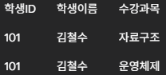

# Normalizaion (정규화)
정규화란?

**하나의 테이블에서 데이터의 중복을 최소화하고 데이터 무결성을 확보하기 위해 정해진 규칙에 따라 테이블을 분리해 나가는 과정**

### 정규화의 기대효과

1. **이상 현상 제거**
2. **데이터베이스 확장 및 구조 변경 용이**
    - 정규화를 거치면 중복 데이터가 최소화되므로 확장과 구조 변경에 용이하다. 큰 테이블이 작은 구조로 분리되어 있으므로 비교적 적은 양의 구조 변경으로 확장에 용이하다.
        
        (예시) 수강 신청 테이블
        
        **정규화 전 (하나의 큰 테이블)**
        
        
        
        이 구조의 문제점
        
        1. 정보 수정의 어려움 : 교수 연구실이 변경되면 관련된 모든 학생 데이터를 찾아서 수정해야 함
        2. 구조 변경 및 확장의 어려움 : 교수 이메일 컬럼을 추가할 경우 데이터 중복 발생
        
        **정규화 후 (나누어진 테이블들)**
        
        

        

        
        
        1. 정보 수정 용이 : 교수 연구실이 변경되면 교수 테이블에서 하나의 행만 수정하면 됨
        2. 구조 변경 및 확장 용이 : 교수 이메일이 추가되면 교수 테이블에 이메일 컬럼만 추가하면 됨
        
3. **질의 속도의 변화**
    - 테이블의 데이터 용량이 줄어 질의 시간이 빨라질 수도 있지만, 질의 시 연관 테이블의 JOIN 연산이 증가함에 따라 질의 응답시간이 빨라질 수도, 느려질 수도 있다. 만약 성능 저하가 발생한다면 반정규화(정규화하지 않는 것)를 고려할 수 있다.
    

---

## 정규화 종류

### 1. 제1정규형 (1NF - First Normal Form)

**테이블의 모든 컬럼 값은 원자 값이어야 한다**

**목표 :** 컬럼에 반복되는 값이나 그룹 값을 제거한다

**해결 :** 반복되는 그룹 값을 별도의 행으로 분리한다

- Before
    
    
    
- After
    
    
    

### 2. 제2정규형 (2NF)

**테이블이 제1정규형을 만족하고, 모든 컬럼이 기본 키(Primary key)에 완전하게 함수 종속되어야 한다**

→ 부분 함수 종속을 제거하는 과정. 복합 기본 키(Composite PK)의 일부에만 종속되는 컬럼이 없어야 한다

**목표 :** 복합 키의 일부에만 종속되는 일반 칼럼을 찾아 분리한다

**해결 :** 부분 종속이 발생하는 컬럼들을 별도의 테이블로 분리한다

- Before
    
    
    
    → 기본 키가 학생ID, 과목코드일 때 학생 이름은 학생ID에만, 과목명은 과목코드에만 종속됨 
    
- After
    
    <수강 테이블>
    
    
    
    <학생 테이블>
    
    
    
    <과목 테이블>
    
    
    

### 3. 제3정규형 (3NF)

**테이블이 제2정규형을 만족하고, 기본 키가 아닌 모든 컬럼이 서로 종속 관계(이행 함수 종속)를 가지지 않아야 한다**

→ “A→B 이고 B→C일 때, A→C가 성립”하는 관계를 없애는 것 (A: 기본키, B,C: 일반컬럼)

**목표 :** 기본 키가 아닌 일반 컬럼에 종속된 다른 일반 컬럼을 찾아 분리한다

**해결 :** 이행 종속 관계에 있는 컬럼들을 별도의 테이블로 분리한다

- Before
    
    
    
    → 학생ID가 학과코드를 결정하고, 학과코드가 학과명을 결정한다
    
- After
    
    <학생 테이블>

    
    
    <학과 테이블>
    
    
    

### 4. BCNF (Boyce-Codd Normal Form)

**테이블이 제3정규형을 만족하고, 모든 결정자가 후보 키여야 한다**

→ 제3정규형보다 조금 더 엄격한 규칙. 후보 키가 아닌 컬럼이 다른 컬럼을 결정해서는 안 된다. 대부분의 경우 3NF와 BCNF는 동일하지만, 복수의 후보 키가 있고 서로 겹치는 경우에 차이가 발생한다

**목표 :** 후보 키가 아닌데 다른 컬럼을 결정하는 ‘결정자’를 찾아 분리한다

- Before
    
    
    
    → 기본키(후보 키)가 학생ID, 과목명인데 또 다른 결정자인 담당교수가 과목명을 결정한다.
     
     (한 교수는 한 과목만 가르친다고 가정)
    
- After
    
    <수강정보 테이블>
    
    
    
    <교수과목 테이블>
    
    
    

---

### 5. 제4정규형

**BCNF를 만족하면서 하나의 테이블에 서로 관련 없는 다중 값 속성이 존재하지 않도록 하는 것**

다치 종속성 : 하나의 키 값에 대해 서로 관련 없는 두 개 이상의 다중 속성 집합이 존재하는 경우

### 6. 제5정규형

**제4정규형을 만족하면서 테이블이 가진 모든 조인 종속성이 후보 키를 통해서만 성립되도록 하는 것**

→ 테이블을 여러 개로 분해했다가, 다시 원래대로 복원하기 위해 분해했던 모든 테이블을 조인(JOIN)해야만 하는 특수한 경우를 뜻함

---

### 요약

| **정규형 (Normal Form)** | **핵심 목표** | **실용성 및 현실적 위치** |
| --- | --- | --- |
| **제1정규형 (1NF)** | 모든 컬럼 값을 **원자 값(Atomic Value)**으로 만들기 | **필수.** 모든 관계형 데이터베이스의 기본 전제 조건. |
| **제2정규형 (2NF)** | **부분 함수 종속** 제거 (복합 키의 일부에만 종속되는 컬럼 분리) | **권장.** 복합 키를 사용하는 경우 반드시 거치는 과정. |
| **제3정규형 (3NF)** | **이행 함수 종속** 제거 (일반 컬럼 간의 종속 관계 분리) | **실무 표준.** 대부분의 데이터베이스 설계가 목표로 하는 **최소한의 정규화 수준.** |
| **BCNF** | 모든 **결정자**가 **후보 키**가 되도록 만들기 (3NF보다 엄격) | **이상적 목표.** 3NF로 충분한 경우가 많지만, BCNF까지 만족하면 데이터 무결성이 더 높아짐. |
| **제4정규형 (4NF)** | **다치 종속성(Multivalued Dependency)** 제거 | **학술적/이론적.** 애초에 4NF를 위반하도록 설계하는 경우가 거의 없어 실무에서 거의 다루지 않음. |
| **제5정규형 (5NF)** | **조인 종속성(Join Dependency)** 제거 | **학술적/이론적.** 식별이 매우 어렵고, JOIN으로 인한 성능 저하가 커서 실무에서는 전혀 고려하지 않음. |