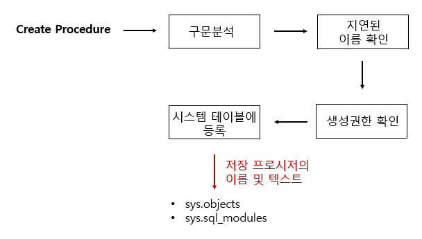
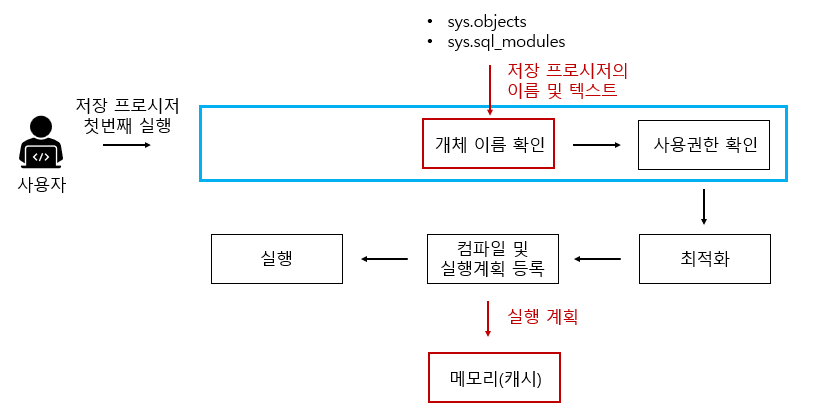
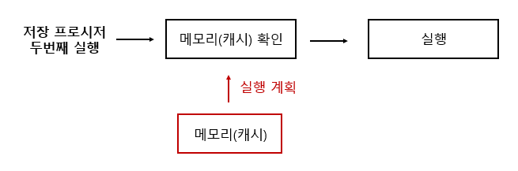

# 저장 프로시저(Stored PROCEDURE)

<aside>
💡

쿼리를 마치 하나의 함수처럼 실행하기 위한 쿼리의 집합

</aside>

⇒ 특정 로직의 쿼리를 함수로 만들어 놓은 것!!

> **저장프로시저와 함수의 차이**
> 
> - 저장 프로시저 : 일련의 작업을 저리한 절차, 리턴값이 없거나 많을 수도 있음, 서버에서 실행되기 때문에 속도가 빠르다
> - 함수 : 여러 작업을 위한 기능, 리턴값이 필수, 클라이언트에서 실행되기 때문에 프로시저보다 느리다

# 일반 쿼리문 vs 저장 프로시저

## [ 일반 쿼리문 ]

](img/image.png)


```sql
SELECT name FROM userTb1;
```

- 구문 분석 : 구문 자체에 오류가 있는지 분석함/ 오타 있으면 에러 메시지 출력
- 개체 이름 확인 : userTb1이 현재 db에 있는지 확인 → name이 userTb1에 있는지 확인
- 사용권한 확인: userTb1을 사용자가 권한이 있는지 확인
- 최적화: 가장 좋은 성능을 낼 수 있는 경로 결정
    - 전체 데이터를 가져오는 거라서 테이블 스캔이나 인덱스 스캔!
        - `테이블스캔` : 테이블에 있는 모든 행(Row)을 **처음부터 끝까지 전부 읽는 방식**
        - `인덱스 스캔` : 테이블 전체를 보지 않고, **인덱스 구조(B-Tree 등)** 를 이용해 필요한 데이터만 빠르게 찾아가는 방식
- 컴파일 및 실행 계획 등록 : 해당 실행 계획 결과를 메모리(캐시)에 등록
- 컴파일 결과 실행

## [ 저장 프로시저 ]

### 1. 저장 프로시저 정의 단계



- 구문 분석 : 구문의 오류 파악
- 지연된 이름 확인 : 저장 프로시저를 정하는 시점에서 해당 개체가 존재하지 않아도 상관없다. 프로시저 실행 당시에 테이블 존재 여부 확인함
- 생성권환 확인 : 현재 사용자가 저장 프로시저를 생성할 권한이 있는지 확인
- 시스템 테이블에 등록  : 저장 프로시저의 이름 및 코드가 시스템 테이블에 등록

### 2. 처음 저장 프로시저 실행



구문 분석 단계를 제외하고 일반적 쿼리문과 동일하다.

### 3. 이후 저장 프로시저 실행



# 프로시저의 장점

1. **최적화 & 캐시**
    
    프로시저의 최초 실행 시 최적화 상태로 컴파일이 되며, 그 이후 프로시저 캐시에 저장된다.
    
    만약 해당 프로세스가 여러 번 사용될 때, 다시 컴파일 작업을 거치지 않고 캐시에서 가져오게 된다.
    
2. **유지 보수**
    
    작업이 변경될 때, 다른 작업은 건드리지 않고 프로시저 내부에서 수정만 하면 된다. (But, 장점이 단점이 될 수도 있는 부분이기도.. )
    
3. **트래픽 감소**
    
    클라이언트가 직접 SQL문을 작성하지 않고, 프로시저명에 매개변수만 담아 전달하면 된다. 즉, SQL문이 서버에 이미 저장되어 있기 때문에 클라이언트와 서버 간 네트워크 상 트래픽이 감소된다.
    
4. **보안**
    
    프로시저 내에서 참조 중인 테이블의 접근을 막을 수 있다.
    

# 프로시저의 단점

1. **호환성**
    
    구문 규칙이 SQL / PSM 표준과의 호환성이 낮기 때문에 코드 자산으로의 재사용성(확장)이 나쁘다.
    
    즉 DB 교체는 거의 불가능하다/ DB의 수를 늘리는 것이 어렵다.
    
2. **낮은 처리 성능**
    
    문자 또는 숫자 연산에서 프로그래밍 언어인 C나 Java보다 성능이 느리다.
    
3. **디버깅(데이터 분석의 어려움)**
    
    에러가 발생했을 때, 어디서 잘못됐는지 디버깅하는 것이 힘들 수 있다.
    

# 문법 예시

### 1. 프로시저 정의

```sql
DELIMITER $$
CREATE PROCEDURE 'TEST_PROC' (
    -- 파라미터 선언
    PARAM_NAME VARCHAR(20),
    PARAM_AGE INT
)
BEGIN
    -- 변수 선언
    DECLARE PARAM_NUM INTEGER;
    
    -- 쿼리문1
    SELECT COUNT(*) + 1
    	INTO PARAM_NUM
        FROM table1;
        
    -- 쿼리문2
    INSERT INTO table1(total_count, user_name, user_age) VALUES(PARAM_NUM, PARAM_NAME, PARAM_AGE);
END $$
DELIMITER ;
```

### 2. 호출

```sql
CALL TEST_PROC('테스트이름', 21);
```

### 3. IN, OUT, INOUT 사용

```sql
DELIMITER $$
CREATE PROCEDURE 'TEST_PROC2'(
    IN loopCount1 INT,     -- input : 10
    IN loopCount2 INT,     -- input : 20
    OUT rst1 INT,
    OUT rst2 INT,
    INOUT rst3 INT
)
BEGIN
    DECLARE NUM1 INTEGER DEFAULT 0;    -- DEFAULT : 초기값 설정
    DECLARE NUM2 INTEGER DEFAULT 0;
    DECLARE NUM3 INTEGER DEFAULT 0;
    
    WHILE NUM1<loopCount1 DO           -- NUM1은 0~9까지 10번반복
        WHILE NUM2<loopCount2 DO       -- NUM2는 0~19까지 20번반복
            SET NUM3 = NUM3 + 1;
            SET NUM2 = NUM2 + 1;
        END WHILE;                     -- NUM2가 19가 되면 나옴
        
        SET NUM1 = NUM1 + 1;
        SET NUM2 = 0;
    END WHILE;
    
    SET rst1 = NUM1;
    SET rst2 = NUM3;
    SET rst3 = rst1 + rst2 + rst3;
END $$
DELIMITER ;
```

### **4. 프로시저 목록 확인**

`SHOW PROCEDURE STATUS;`

### **5. 프로시저 내용 확인**

`SHOW CREATE PROCEDURE 프로시저이름;`

### **6. 프로시저 삭제**

`DROP PROCEDURE 프로시저이름;`

# 질문

- **저장 프로시저와 일반 SQL 문장의 차이점은 무엇인가요?**
- **저장 프로시저를 사용하는 이유는 무엇인가요?**
- **저장 프로시저의 장단점을 말해보세요.**