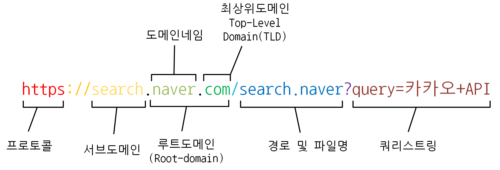

# DNS

웹주소 창에 복잡한 IP 주소가 아니라 [`www.naver.com`](http://www.naver.com) 과 같은 웹 주소를 검색하는 게 DNS다!

## 도메인 주소가 IP로 변환하는 과정

![**[출처]** [[ DNS 서버 ] DNS란? 도메인과 URL의 차이, URL의 구조, 도메인의 계층 관계, DNS 동작 방식](https://blog.naver.com/ghdalswl77/222331240558)](img/dnsProcess.png)

**[출처]** [[ DNS 서버 ] DNS란? 도메인과 URL의 차이, URL의 구조, 도메인의 계층 관계, DNS 동작 방식]

1. 가장 가까운 곳에 있는 DNS에 www.naver.com의 IP를 문의한다
   1. 가장 가까운 DNS 서버가 알고 있으면 직접 IP 주소를 알려준다.
2. 루트 도메인 네임 서버에게 문의한다.

   

3. 루트 네임서버에 등록된 `.com` 네임서버의 IP를 전달합니다.
4. `.com 도메인`을 관리하는 네임서버에게 문의
5. .com 네임서버는 `.naver.com`의 네임서버 IP 주소를 알려줍니다.
6. .naver.com의 네임서버에게 네이버의 웹서버인 `www.`의 IP를 문의
7. naver의 네임 서버는 `www.naver.com`의 IP를 알려줍니다.
8. 네이버의 네임 서버에서 알아온 www.naver.com의 IP 주소를 클라이언트에게 알려준다.
9. 클라이언트는 해당 IP주소에 특정 파일을 요청합니다
10. 클라이언트가 요청한 파일을 클라이언트에게 보여
